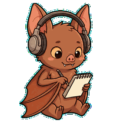

# Bat Listener

Пользовательский v2-питомец для Codex: летучая мышь LearnSpeakRepeat в наушниках, которая внимательно слушает и делает заметки.



## Установка

macOS и Linux:

```bash
mkdir -p "$HOME/.codex/pets/bat-listener"
curl -L https://raw.githubusercontent.com/krasnoperov/pets/main/bat-listener/pet.json \
  -o "$HOME/.codex/pets/bat-listener/pet.json"
curl -L https://raw.githubusercontent.com/krasnoperov/pets/main/bat-listener/spritesheet.webp \
  -o "$HOME/.codex/pets/bat-listener/spritesheet.webp"
```

После установки перезапустите Codex и выберите Bat Listener в настройках питомцев.

## Состав пакета

- `pet.json` — описание питомца и версия формата.
- `spritesheet.webp` — v2-атлас размером `1536×2288`.
- `preview.gif` — превью спокойной анимации.
- `contact-sheet.png` — все стандартные и направленные состояния.
- `validation.json` — результат детерминированной проверки атласа.
